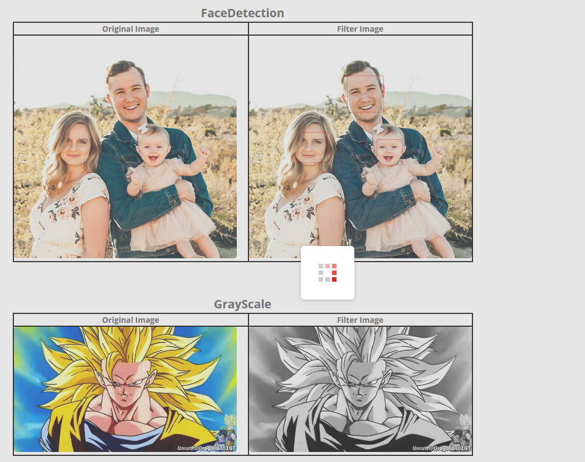
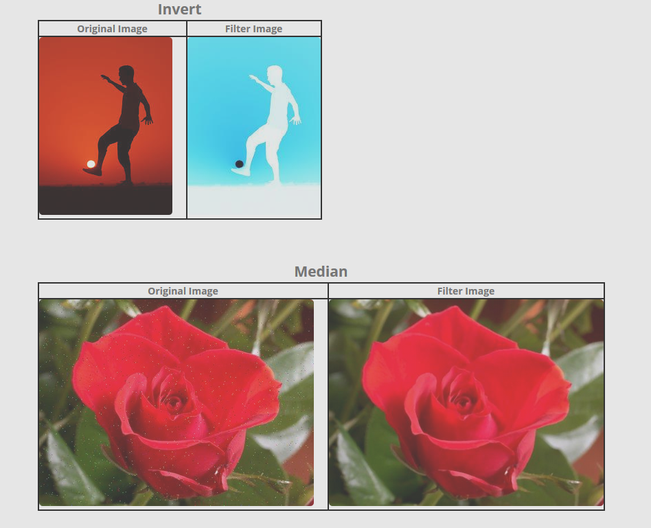
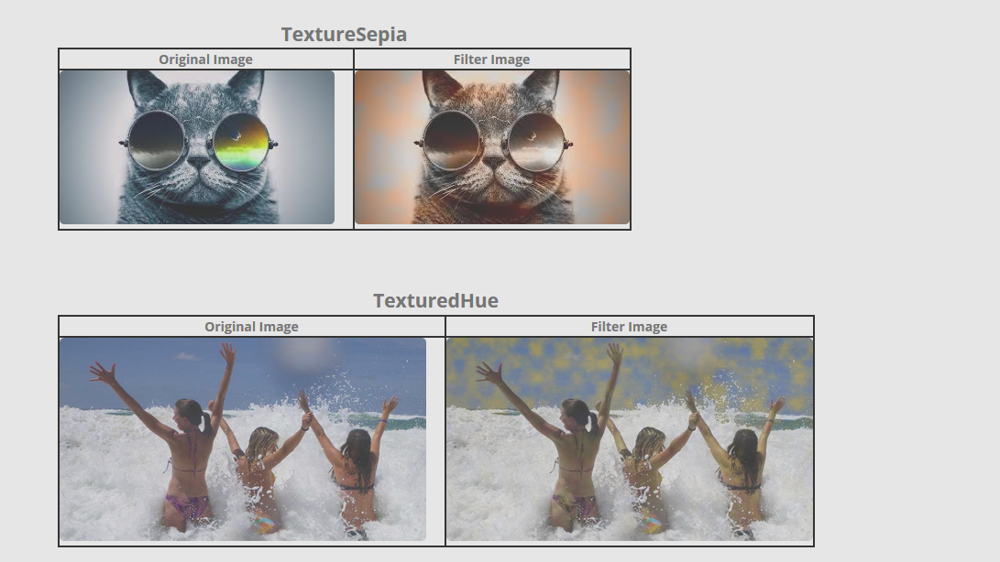
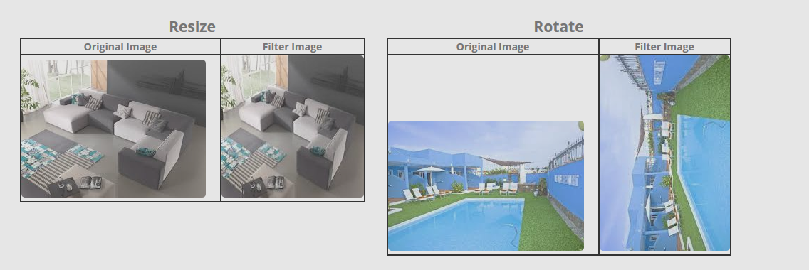

# Documentation

Here you can find the information about our package, how to install it and configure it.

## Summary

**Category:** Best extension of the editing experience for SXA in Experience Editor

The purpose of this module is allow to the final user add images and edit them, like changing colors, add noise correction filters, add texture filters and face detection.

## Pre-requisites

Download this packages:  
-Sitecore PowerShell Extensions-5.0.zip  
-Sitecore Experience Accelerator 1.8 rev. 181112 for 9.1.zip

## Installation

Install these packages in the same order listed above. then install this package in order to configurare our module. 
-hackathon.image.filter.zip

## Configuration

Once both packages are installed, you must insert Tenant site in the content node and then configure it following the assistant.
The name of tenant node have to be Hackathon, then the website name have to be SXA Website.

## Usage

Component working with face recognitions and gray scale

Component working with Invert and Median

Component working with different kind of textures

Component working with resize and rotate

## Video

Please provide a video highlighing your Hackathon module submission and provide a link to the video. Either a [direct link](https://www.youtube.com/watch?v=EpNhxW4pNKk) to the video, upload it to this documentation folder or maybe upload it to Youtube...

